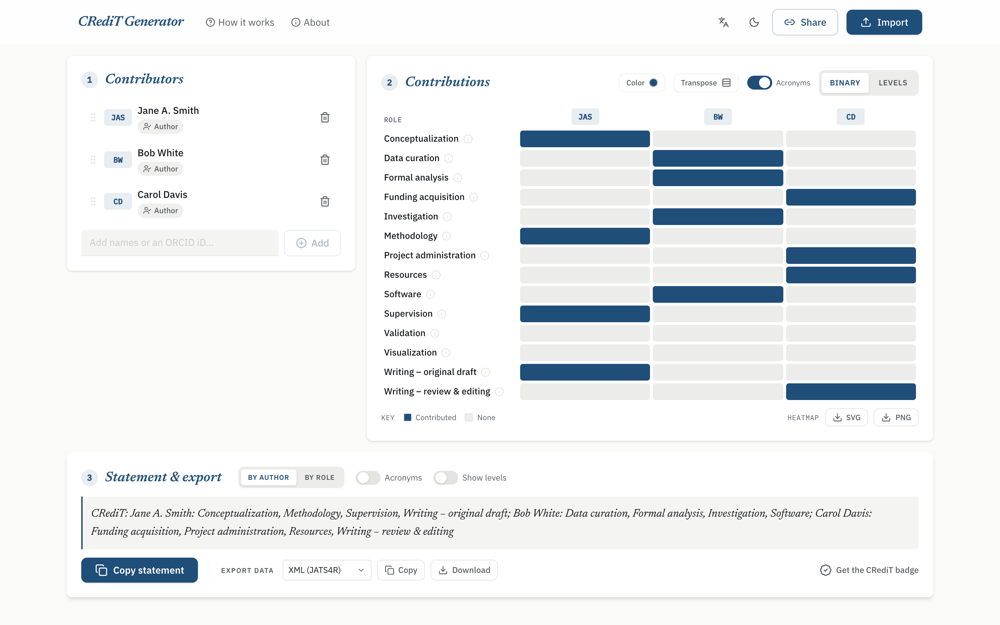
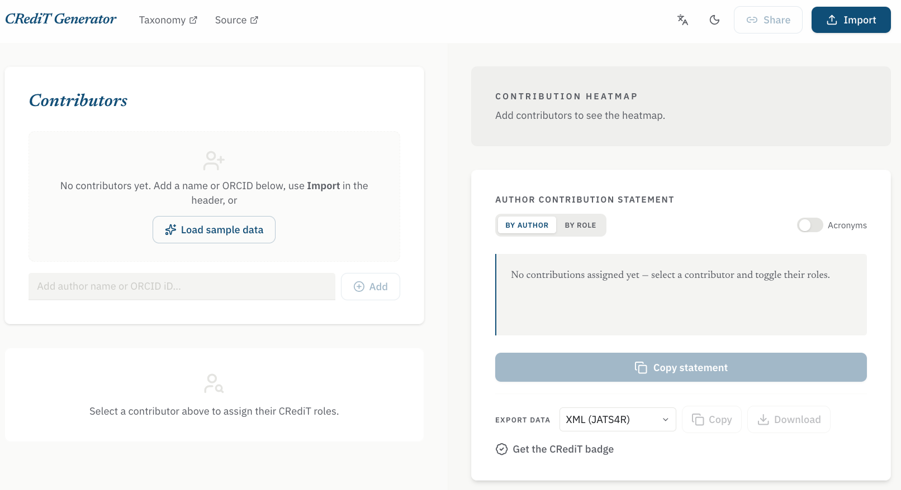
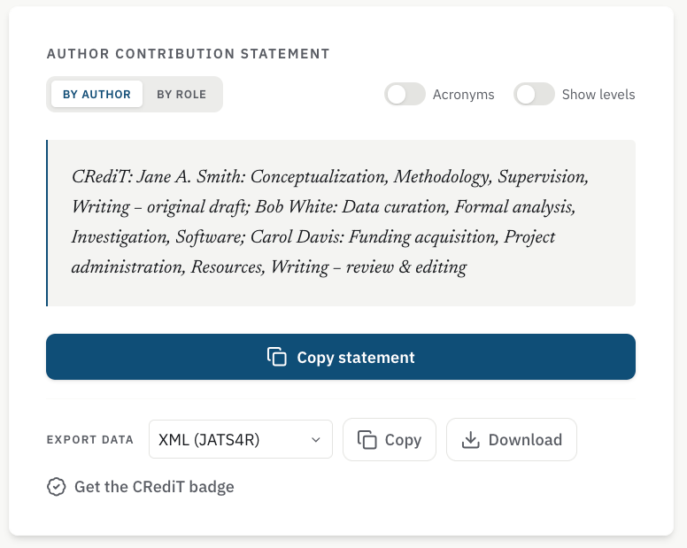

# CRediT Generator

[](https://github.com/simonvanlierde/credit-heatmap/actions/workflows/ci.yml)
[](https://codecov.io/gh/simonvanlierde/credit-heatmap)
[](https://credit.duinlab.nl)
[](LICENSE)
[](CONTRIBUTING.md)
[](https://doi.org/10.5281/zenodo.21213659)

A web app for drafting [CRediT (Contributor Roles Taxonomy)](https://credit.niso.org/)
contribution statements for scholarly publications.

Add contributors, assign the 14 CRediT roles, and copy a manuscript-ready statement. It also
produces a contribution heatmap and exports for journal submission systems: JATS4R XML, CSV, JSON,
and Markdown.

Inspired by the original
[Python/Dash CRediT Generator](https://github.com/IPHYS-Bioinformatics/CRediT-Generator) and the
contributorship tools and scholarship credited under [Acknowledgements](#acknowledgements).

**Try it:** [credit.duinlab.nl](https://credit.duinlab.nl)



## What it does

- **Contributors**: add, rename, reorder, and paste an ORCID iD or URL to look up the name
- **Contribution matrix**: assign each role as a yes/no value or as a contribution level
- **Presets**: apply common patterns like equal contribution, senior author, and data-only
- **Statements**: render by role or by author, with full names or initials and optional level labels
- **Localized output**: translate role names in statements, Markdown tables, and heatmaps (via
  [credit-translation](https://github.com/contributorshipcollaboration/credit-translation));
  machine-readable exports keep canonical English CRediT terms
- **Heatmap**: preview in the browser, download as SVG or PNG
- **Exports**: copy or download JATS4R XML, CSV, JSON, and Markdown
- **Validation**: flag contributors with no roles or missing key roles
- **Sharing & import**: encode a draft in a URL, paste names, or import JSON, CSV, or JATS4R XML
- **Accessible**: skip link, landmark regions, keyboard drag-to-reorder with screen-reader
  announcements, and a reduced-motion fallback

| First run | Statement & export |
|---|---|
|  |  |

## Architecture

```text
Browser
  └─ Next.js app  (repo root, App Router)
       ├─ React UI + Zustand store (persisted to localStorage)
       ├─ @credit-generator/core   ← all domain logic, runs in the browser
       │     statements · JATS4R XML · CSV · JSON · Markdown · heatmap SVG · validation
       └─ /api/orcid  (route handler) ──→ pub.orcid.org    ← the only server-side call
```

Nearly everything runs in the browser. [`packages/core`](packages/core/README.md) holds the domain
logic: statements, exports, validation, XML import (native `DOMParser`), and the heatmap SVG, as
pure TypeScript with one runtime dependency, `zod`. The PNG download is drawn from that same SVG on a
`<canvas>`.

The one server-side call is the ORCID lookup. The ORCID public API sends no CORS headers, so
`/api/orcid` proxies it through a small Next.js route handler. (`/health` backs uptime monitors.)

Contributions persist as a 0-100 integer `score`, not a boolean, so the UI can switch between binary
and level-based editing without changing the stored model — see
[`packages/core/README.md`](packages/core/README.md#domain-model) for the score-to-level boundaries.

## Stack

| Layer | Choice | Why |
|---|---|---|
| Workspace | pnpm workspaces | App at the root + a reusable `packages/core` library |
| Language | TypeScript 6 (strict) | `noUncheckedIndexedAccess` on |
| Frontend | Next.js 16 (App Router) | Deploys to Cloudflare Workers |
| Styling | Tailwind CSS v4 | Design tokens via `@theme`; no runtime CSS |
| State | Zustand + immer + persist | Local app state, persisted to `localStorage` |
| Validation | Zod | Runtime-safe schemas at trust boundaries |
| Heatmap | @nivo/heatmap + hand-crafted SVG (`core`) | Interactive preview; one SVG source for download + canvas PNG |
| Testing | Vitest (unit) + Playwright (e2e) | Domain tests plus browser happy paths |
| Linting | Biome | One tool for format + lint |
| Deploy | Cloudflare Workers (OpenNext) | Zero-ops serverless edge |

## Quick start

**Prerequisites:** Node ≥ 22, pnpm ≥ 9, [just](https://github.com/casey/just) (optional)

```bash
git clone https://github.com/simonvanlierde/credit-heatmap
cd credit-heatmap
pnpm install
pnpm dev            # → http://localhost:3000
```

See [CONTRIBUTING.md](CONTRIBUTING.md) for the full command list, dev workflow, and the
lint/typecheck/test checklist. Run `just` to list the watch/fix recipes layered on the pnpm scripts.

## Deployment

The live demo runs on Cloudflare Workers via
[`@opennextjs/cloudflare`](https://opennext.js.org/cloudflare), which adapts the Next.js build.

**Pipeline:** push to `main` → Cloudflare
[Workers Builds](https://developers.cloudflare.com/workers/ci-cd/builds/) builds and deploys to
[credit.duinlab.nl](https://credit.duinlab.nl). The trigger is configured in the Cloudflare
dashboard (settings mirrored in [wrangler.jsonc](wrangler.jsonc)); non-`main` branches and PR
previews are disabled. [CI](.github/workflows/ci.yml) only lints, tests, and build-checks.

**Manual deploy** (needs Cloudflare credentials):

```bash
pnpm preview        # build + run the Worker locally
pnpm deploy         # build + deploy to Cloudflare
```

Config lives in [wrangler.jsonc](wrangler.jsonc) and [open-next.config.ts](open-next.config.ts).

## Roadmap

- **Localize the app UI.** Today only the output (statements, Markdown tables, heatmaps) uses the
  bundled role translations; the interface itself is English-only.
- **Widen locale coverage.** Only a curated subset of
  [credit-translation](https://github.com/contributorshipcollaboration/credit-translation) locales is
  vendored under [`packages/core/src/credit-i18n/translations`](packages/core/src/credit-i18n/translations);
  refresh them with `node packages/core/scripts/fetch-credit-translations.mjs`.
- **Smooth onboarding.** Better empty states and a gentler path from a blank workspace to a finished
  statement.

## Contributing

Bug reports and small features are welcome — see [CONTRIBUTING.md](CONTRIBUTING.md) for setup,
testing, and the accessibility checks. Design decisions are recorded as [ADRs](docs/adr/).

## Citing this software

If you use the CRediT Generator in your work, please cite it. Metadata lives in
[CITATION.cff](CITATION.cff), and GitHub's "Cite this repository" button generates APA and BibTeX from
it. The archived, versioned release is on Zenodo: [doi:10.5281/zenodo.21213659](https://doi.org/10.5281/zenodo.21213659).

> van Lierde, S. *CRediT Generator* [Computer software]. Zenodo. <https://doi.org/10.5281/zenodo.21213659>

## Acknowledgements

The CRediT Generator builds on prior tools and scholarship on contributorship:

- The original [Python/Dash CRediT Generator](https://github.com/IPHYS-Bioinformatics/CRediT-Generator),
  which inspired this app.
- Role translations from
  [credit-translation](https://github.com/contributorshipcollaboration/credit-translation).
- The **contribution matrix** proposed by Nick Steinmetz (2019), the visual form this app's heatmap
  descends from — as surveyed in *Nature Index*,
  ["Researchers are embracing visual tools to give fair credit…"](https://www.nature.com/nature-index/news/researchers-embracing-visual-tools-contribution-matrix-give-fair-credit-authors-scientific-papers).

### Related work

- Brand, A., Allen, L., Altman, M., Hlava, M., & Scott, J. (2015). Beyond authorship: attribution,
  contribution, collaboration, and credit. *Learned Publishing, 28*(2), 151–155.
  <https://doi.org/10.1002/leap.1210>
- Holcombe, A. O., Kovács, M., Aust, F., & Aczel, B. (2020). Documenting contributions to scholarly
  articles using CRediT and tenzing. *PLOS ONE, 15*(12), e0244611.
  <https://doi.org/10.1371/journal.pone.0244611>
- Nakagawa, S., Ivimey-Cook, E. R., Grainger, M. J., O'Dea, R. E., et al. (2023). Method Reporting
  with Initials for Transparency (MeRIT) promotes more granularity and accountability for author
  contributions. *Nature Communications, 14*, 1788. <https://doi.org/10.1038/s41467-023-37039-1>
