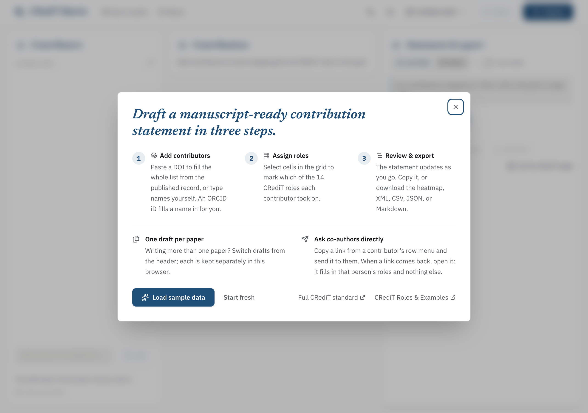
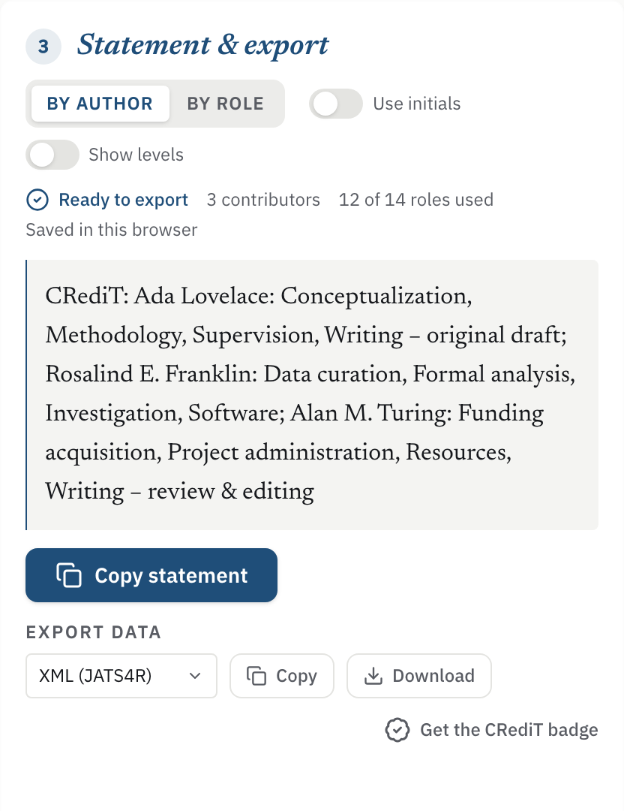

# CRediT Matrix

[](https://github.com/simonvanlierde/credit-matrix/actions/workflows/ci.yml)
[](https://codecov.io/gh/simonvanlierde/credit-matrix)
[](https://credit.duinlab.nl)
[](https://doi.org/10.5281/zenodo.21213659)
[](LICENSE)
[](CONTRIBUTING.md)

A web app for drafting [CRediT (Contributor Roles Taxonomy)](https://credit.niso.org/) contribution
statements for scholarly publications. Formerly released as *CRediT Generator*.

Add contributors, assign the 14 roles, and copy a manuscript-ready statement. The same grid is a
**contribution heatmap** you can export as a figure, alongside files for journal submission systems:
JATS4R XML, CSV, JSON, and Markdown.

CRediT Matrix is an independent project. It is not affiliated with or endorsed by NISO.

**Try it:** [credit.duinlab.nl](https://credit.duinlab.nl)


## What it does

- **Contributors**: add, rename, reorder, or paste a whole author list. Paste an ORCID iD or URL to
  look up the name, or a DOI to fill the whole list from the published record
- **Ask your co-authors**: send each person a link addressed to their own row. They tick what they
  did and send the link back; opening it fills in their row — roles, name, and iD — and nothing
  else
- **Drafts**: one per paper, switched from the header. They stay in this browser
- **Contribution grid**: click a cell to assign one of the 14 roles, as a yes/no value or as a
  contribution level. The grid is the heatmap, so you can transpose it, swap initials for full
  names, and recolor it
- **Statements**: group by role or by author, with full names or initials, and optional level
  labels. Copy as rich text or plain, and mark shared first authorship and corresponding authors
- **Nine languages**: the interface and the generated statement each pick their own language, so a
  Dutch interface can produce an English statement. Role names come from
  [credit-translation](https://github.com/contributorshipcollaboration/credit-translation);
  machine-readable exports keep the canonical English CRediT terms
- **Exports**: copy or download JATS4R XML, CSV, JSON, and Markdown, or download the heatmap as SVG
  or PNG
- **Sharing and import**: encode a draft in a URL, paste names, or import JSON, CSV, or JATS4R XML
- **Works offline**: install it, and a draft survives a flight. Only the ORCID and DOI lookups need
  a network

| First run | Statement & export |
|---|---|
|  |  |

---

## Architecture

TypeScript 6 throughout, on pnpm workspaces: the app at the root, reusable `packages/core` beside
it.

| Layer | Choice | Why |
|---|---|---|
| Frontend | Next.js 16 (App Router) | Runs on Cloudflare Workers via OpenNext |
| Styling | Tailwind CSS v4 | Design tokens via `@theme`; no runtime CSS |
| State | Zustand + immer + persist | Survives a refresh via localStorage |
| Validation | Zod | Schema checks at trust boundaries |
| Heatmap | Hand-crafted SVG (`core`) | One SVG source feeds both download and canvas PNG |
| Offline | Service worker + manifest | Runtime cache of the app's own files; no build step |

```text
Browser
  └─ Next.js app  (repo root, App Router)
       ├─ React UI + Zustand store (persisted to localStorage)
       ├─ @credit-generator/core   ← all domain logic, runs in the browser
       │     statements · JATS4R XML · CSV · JSON · Markdown · heatmap SVG · validation
       └─ /api/orcid · /api/doi  (route handlers) ──→ pub.orcid.org · api.crossref.org
                                                      ← the only server-side calls
```

Nearly everything runs in the browser. [`packages/core`](packages/core/README.md) holds the domain
logic as pure TypeScript, with `zod` as its only runtime dependency. XML import uses the native
`DOMParser`, and the PNG is drawn from the heatmap SVG onto a `<canvas>`.

The ORCID and DOI lookups are the exceptions, proxied by `/api/orcid` and `/api/doi`. ORCID's
public API sends no CORS headers. Crossref's polite-pool contact address belongs on the server,
not in every client bundle.

Contributions store a 0–100 integer `score` rather than a boolean, so the UI switches between
binary and level-based editing without changing the stored model. See
[`packages/core/README.md`](packages/core/README.md#domain-model) for the score-to-level boundaries.

**No accounts, no server-side storage.** This is a deliberate constraint, not a missing feature. A
draft holds the names and ORCID iDs of co-authors who never visited this site. Keeping those in
your browser means there is nothing to ask anyone to delete. Drafts are per-browser: move one
between devices by exporting JSON. See
[ADR 0002](docs/adr/0002-no-accounts-or-server-side-storage.md) for what would have to change for
this to be revisited.

---

## Self-hosting

**Prerequisites:** Node ≥ 26, pnpm ≥ 11, [just](https://github.com/casey/just) (optional)

```bash
git clone https://github.com/simonvanlierde/credit-matrix
cd credit-matrix
pnpm install
pnpm dev            # → http://localhost:3000
```

[CONTRIBUTING.md](CONTRIBUTING.md) has the full command list and the lint/typecheck/test checklist.
Run `just` to list the watch/fix recipes layered on the pnpm scripts.

### Deployment

The live demo runs on Cloudflare Workers via
[`@opennextjs/cloudflare`](https://opennext.js.org/cloudflare), which adapts the Next.js build. A
push to `main` builds and deploys it; [CI](.github/workflows/ci.yml) lints, tests, and
build-checks, and never deploys.

To run the Worker yourself, set your own domain and bindings in
[wrangler.jsonc](wrangler.jsonc) and [open-next.config.ts](open-next.config.ts):

```bash
pnpm preview        # build + run the Worker locally
pnpm deploy         # build + deploy to your Cloudflare account
```

Both upstream proxies (`/api/orcid`, `/api/doi`) share one rate-limiter binding, `API_RATE_LIMITER`.
Without the binding, they fail open: the lookups keep working, unthrottled, and say so once in the
invocation log. After changing the binding, check the first deploy's logs for
`API_RATE_LIMITER binding missing`.

## Roadmap

- **Review the translations.** Beside English, the interface ships in eight machine-translated
  languages. `e2e/messages.spec.ts` checks each catalog for key parity, balanced ICU braces, intact
  placeholders, and untranslated product and format names. No native speaker has reviewed the prose,
  though, and Japanese and Chinese need one most: the term for a contribution *statement* is
  unsettled.
- **Widen locale coverage.** Eight translated locales ship today (de, es, fr, it, ja, nl, pt-PT,
  zh-Hans), a curated subset of
  [credit-translation](https://github.com/contributorshipcollaboration/credit-translation), vendored
  under [`packages/core/src/credit-i18n/translations`](packages/core/src/credit-i18n/translations).
  Refresh them with `node packages/core/scripts/fetch-credit-translations.mjs`.
- **Read more from ORCID.** The lookup takes the name only. Affiliation is the field submission
  systems ask for next.
- **Make sharing discoverable.** The onboarding barely hints at sharing a draft or asking a
  co-author to fill in their own row. Both are easy to miss entirely.
- **Move the statement options into a popover.** The statement's toggles sit inline; the heatmap's
  live in an options popover.

## Contributing

Bug reports and small features are welcome. See [CONTRIBUTING.md](CONTRIBUTING.md) for setup,
testing, and the accessibility checks. [PRODUCT.md](PRODUCT.md) states what the app is for and who
it serves; [DESIGN.md](DESIGN.md) is the design system that UI changes are held to. Design decisions
are recorded as [ADRs](docs/adr/).

## Acknowledgements

CRediT Matrix builds on prior tools and scholarship on contributorship:

- The original
  [Python/Dash CRediT Generator](https://github.com/IPHYS-Bioinformatics/CRediT-Generator), which
  inspired this app.
- Role translations from
  [credit-translation](https://github.com/contributorshipcollaboration/credit-translation).
- The **contribution matrix** proposed by Nick Steinmetz (2019), which this app's heatmap descends
  from. *Nature Index* surveys it in
  ["Researchers are embracing visual tools to give fair credit…"](https://www.nature.com/nature-index/news/researchers-embracing-visual-tools-contribution-matrix-give-fair-credit-authors-scientific-papers).

### Related work

- Brand, A., Allen, L., Altman, M., Hlava, M., & Scott, J. (2015). Beyond authorship: attribution,
  contribution, collaboration, and credit. *Learned Publishing, 28*(2), 151–155.
  <https://doi.org/10.1002/leap.1210>
- Holcombe, A. O., Kovács, M., Aust, F., & Aczel, B. (2020). Documenting contributions to scholarly
  articles using CRediT and tenzing. *PLOS ONE, 15*(12), e0244611.
  <https://doi.org/10.1371/journal.pone.0244611>
- Nakagawa, S., Ivimey-Cook, E. R., Grainger, M. J., O'Dea, R. E., et al. (2023). Method Reporting
  with Initials for Transparency (MeRIT) promotes more granularity and accountability for author
  contributions. *Nature Communications, 14*, 1788. <https://doi.org/10.1038/s41467-023-37039-1>

## Citing this software

If you use CRediT Matrix in your work, please cite it. Metadata lives in
[CITATION.cff](CITATION.cff), and GitHub's "Cite this repository" button generates APA and BibTeX
from it. The archived, versioned release is on Zenodo:
[doi:10.5281/zenodo.21213659](https://doi.org/10.5281/zenodo.21213659).

> van Lierde, S. *CRediT Matrix* [Computer software]. Zenodo.
> <https://doi.org/10.5281/zenodo.21213659>

## License

[MIT](LICENSE) © Simon van Lierde
