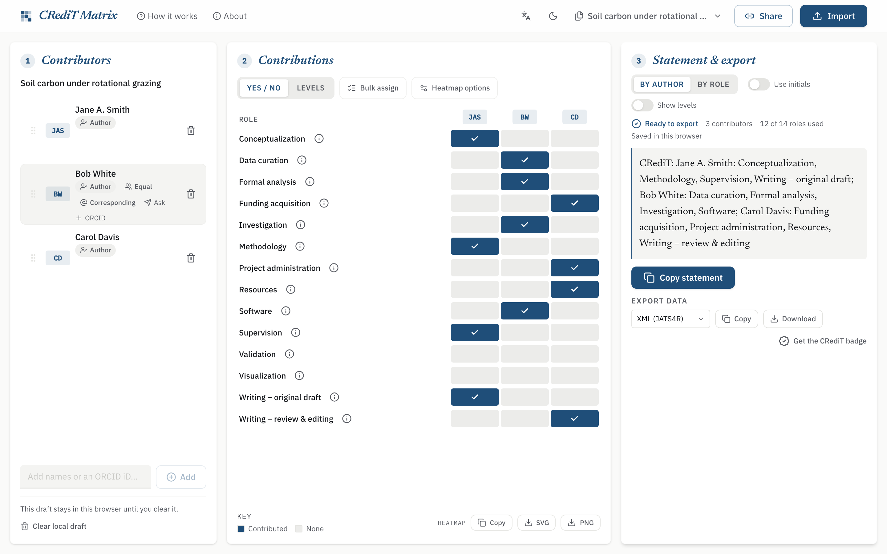

# CRediT Generator

[](https://github.com/simonvanlierde/credit-heatmap/actions/workflows/ci.yml)
[](https://codecov.io/gh/simonvanlierde/credit-heatmap)
[](https://credit.duinlab.nl)
[](https://doi.org/10.5281/zenodo.21213659)
[](LICENSE)
[](CONTRIBUTING.md)

A web app for drafting [CRediT (Contributor Roles Taxonomy)](https://credit.niso.org/) contribution
statements for scholarly publications.

Add contributors, assign the 14 roles, and copy a manuscript-ready statement. The app also builds a
contribution heatmap and exports for journal submission systems: JATS4R XML, CSV, JSON, and
Markdown.

**Try it:** [credit.duinlab.nl](https://credit.duinlab.nl)



## What it does

- **Contributors**: add, rename, reorder, paste a whole author list, or paste an ORCID iD or URL to
  look up the name
- **Contribution grid**: click cells to assign the 14 roles as yes/no values or as contribution
  levels. The grid is the heatmap, so you can transpose it, swap initials for full names, and recolor
  place
- **Statements**: render by role or by author, with full names or initials, and optional level labels
- **Localized output**: translate role names in statements, Markdown tables, and heatmaps (via
  [credit-translation](https://github.com/contributorshipcollaboration/credit-translation)).
  Machine-readable exports keep the canonical English CRediT terms
- **Heatmap**: download the grid as SVG or PNG
- **Exports**: copy or download JATS4R XML, CSV, JSON, and Markdown
- **Sharing and import**: encode a draft in a URL, paste names, or import JSON, CSV, or JATS4R XML

| First run | Statement & export |
|---|---|
|  |  |

---

## Architecture

### Stack

TypeScript 6 throughout, on pnpm workspaces (app at the root, reusable `packages/core`).

| Layer | Choice | Why |
|---|---|---|
| Frontend | Next.js 16 (App Router) | Runs on Cloudflare Workers via OpenNext |
| Styling | Tailwind CSS v4 | Design tokens via `@theme`; no runtime CSS |
| State | Zustand + immer + persist | Survives a refresh via localStorage |
| Validation | Zod | Schema checks at trust boundaries |
| Heatmap | Hand-crafted SVG (`core`) | One SVG source feeds both download and canvas PNG |

### Project structure

```text
Browser
  └─ Next.js app  (repo root, App Router)
       ├─ React UI + Zustand store (persisted to localStorage)
       ├─ @credit-generator/core   ← all domain logic, runs in the browser
       │     statements · JATS4R XML · CSV · JSON · Markdown · heatmap SVG · validation
       └─ /api/orcid  (route handler) ──→ pub.orcid.org    ← the only server-side call
```

Nearly everything runs in the browser. [`packages/core`](packages/core/README.md) holds that domain
logic as pure TypeScript, with one runtime dependency: `zod`. XML import uses the native
`DOMParser`, and the PNG download is drawn from the heatmap SVG onto a `<canvas>`.

The one server-side call is the ORCID lookup. The ORCID public API sends no CORS headers, so
`/api/orcid` proxies it through a small Next.js route handler. A `/health` route backs uptime
monitors.

Contributions are stored as a 0–100 integer `score` rather than a boolean. The UI can switch between
binary and level-based editing without touching the stored model. See
[`packages/core/README.md`](packages/core/README.md#domain-model) for the score-to-level boundaries.

---

## Self-hosting

**Prerequisites:** Node ≥ 26, pnpm ≥ 11, [just](https://github.com/casey/just) (optional)

```bash
git clone https://github.com/simonvanlierde/credit-heatmap
cd credit-heatmap
pnpm install
pnpm dev            # → http://localhost:3000
```

[CONTRIBUTING.md](CONTRIBUTING.md) has the full command list and the lint/typecheck/test checklist.
Run `just` to list the watch/fix recipes layered on the pnpm scripts.

### Deployment

The live demo runs on Cloudflare Workers via
[`@opennextjs/cloudflare`](https://opennext.js.org/cloudflare), which adapts the Next.js build.

**Pipeline:** a push to `main` triggers Cloudflare
[Workers Builds](https://developers.cloudflare.com/workers/ci-cd/builds/), which builds and deploys
to [credit.duinlab.nl](https://credit.duinlab.nl). The trigger lives in the Cloudflare dashboard,
mirrored in [wrangler.jsonc](wrangler.jsonc); non-`main` branches and PR previews are turned off.
[CI](.github/workflows/ci.yml) only lints, tests, and build-checks.

**Manual deploy** (needs Cloudflare credentials):

```bash
pnpm preview        # build + run the Worker locally
pnpm deploy         # build + deploy to Cloudflare
```

Config lives in [wrangler.jsonc](wrangler.jsonc) and [open-next.config.ts](open-next.config.ts).

## Roadmap

- **Localize the app UI.** Today only the output (statements, Markdown tables, heatmaps) uses the
  bundled role translations; the interface itself is English-only.
- **Widen locale coverage.** Only a curated subset of
  [credit-translation](https://github.com/contributorshipcollaboration/credit-translation) locales
  is vendored under
  [`packages/core/src/credit-i18n/translations`](packages/core/src/credit-i18n/translations);
  refresh them with `node packages/core/scripts/fetch-credit-translations.mjs`.
- **Keep smoothing onboarding.** The first-run card and empty states landed in 0.2.0. The path from
  a blank workspace to a finished statement can still lose fewer people.

## Contributing

Bug reports and small features are welcome. See [CONTRIBUTING.md](CONTRIBUTING.md) for setup,
testing, and the accessibility checks. [PRODUCT.md](PRODUCT.md) states what the app is for and who
it serves; [DESIGN.md](DESIGN.md) is the design system that UI changes are held to. Design decisions
are recorded as [ADRs](docs/adr/).

## Acknowledgements

The CRediT Generator builds on prior tools and scholarship on contributorship:

- The original
  [Python/Dash CRediT Generator](https://github.com/IPHYS-Bioinformatics/CRediT-Generator), which
  inspired this app.
- Role translations from
  [credit-translation](https://github.com/contributorshipcollaboration/credit-translation).
- The **contribution matrix** proposed by Nick Steinmetz (2019), which this app's heatmap descends
  from. *Nature Index* surveys it in
  ["Researchers are embracing visual tools to give fair credit…"](https://www.nature.com/nature-index/news/researchers-embracing-visual-tools-contribution-matrix-give-fair-credit-authors-scientific-papers).

### Related work

- Brand, A., Allen, L., Altman, M., Hlava, M., & Scott, J. (2015). Beyond authorship: attribution,
  contribution, collaboration, and credit. *Learned Publishing, 28*(2), 151–155.
  <https://doi.org/10.1002/leap.1210>
- Holcombe, A. O., Kovács, M., Aust, F., & Aczel, B. (2020). Documenting contributions to scholarly
  articles using CRediT and tenzing. *PLOS ONE, 15*(12), e0244611.
  <https://doi.org/10.1371/journal.pone.0244611>
- Nakagawa, S., Ivimey-Cook, E. R., Grainger, M. J., O'Dea, R. E., et al. (2023). Method Reporting
  with Initials for Transparency (MeRIT) promotes more granularity and accountability for author
  contributions. *Nature Communications, 14*, 1788. <https://doi.org/10.1038/s41467-023-37039-1>

## Citing this software

If you use the CRediT Generator in your work, please cite it. Metadata lives in
[CITATION.cff](CITATION.cff), and GitHub's "Cite this repository" button generates APA and BibTeX
from it. The archived, versioned release is on Zenodo:
[doi:10.5281/zenodo.21213659](https://doi.org/10.5281/zenodo.21213659).

> van Lierde, S. *CRediT Generator* [Computer software]. Zenodo.
> <https://doi.org/10.5281/zenodo.21213659>

## License

[MIT](LICENSE) © Simon van Lierde
